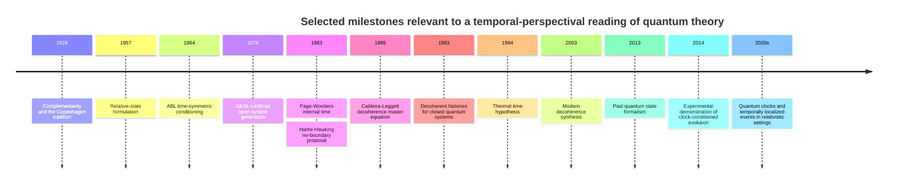
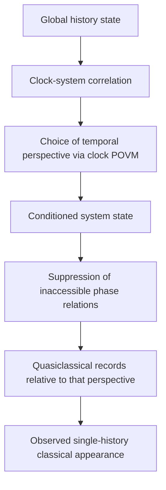

# A Minimal Temporal-Perspectival Interpretation of Quantum Mechanics

Nikolay Maio et. al. (2025)

## Abstract

This manuscript develops a **minimal temporal-perspectival interpretation** of quantum mechanics in which the fundamental object is a global **history state** and the ordinary state of a system at a “time” is a **conditioned state relative to a clock perspective** rather than an ontologically fundamental instantaneous slice. The proposal is deliberately conservative: it adds **no new dynamical law, no hidden variables, no stochastic collapse term, and no empirical deviation** from standard quantum mechanics. Its purpose is interpretive and structural. The guiding claim is that quantum superposition is most naturally understood, at the universal level, as a superposition of **temporally extended alternatives or histories**, while decoherence is understood operationally as the suppression of accessible phase relations **relative to a particular temporal perspective**, represented by a finite-resolution clock POVM. In this minimal version, temporal coarse-graining is not a new physical noise source; it is the information-theoretic consequence of conditioning on an imperfectly localized clock state. We show that this framework is mathematically continuous with the literature on clock-conditioned quantum dynamics, decoherent histories, open-system decoherence, and quantum cosmology, especially the approaches of entity["people","Don Page","page-wootters physicist"] and entity["people","William Wootters","page-wootters physicist"], the histories program of entity["people","James Hartle","quantum cosmologist"], and the decoherence program of entity["people","Wojciech Zurek","decoherence physicist"] (Page and Wootters 1983; Gell-Mann and Hartle 1993; Zurek 2003).

The central formal object is a history state
\[
|\Psi_{\mathrm{hist}}\rangle
=
\int d\tau\,|\tau\rangle_C\otimes |\psi(\tau)\rangle_S,
\]
or its discrete-time analogue, together with a clock POVM \(\Pi_{\tau_0,\sigma_\tau}\) representing a temporal perspective centered at \(\tau_0\) with finite temporal resolution \(\sigma_\tau\). The conditioned state is
\[
\rho^{(\tau_0,\sigma_\tau)}_S
=
\frac{\mathrm{Tr}_C\!\left[(\sqrt{\Pi_{\tau_0,\sigma_\tau}}\otimes I)\,\rho_{CS}\,(\sqrt{\Pi_{\tau_0,\sigma_\tau}}\otimes I)\right]}
{\mathrm{Tr}\!\left[(\Pi_{\tau_0,\sigma_\tau}\otimes I)\rho_{CS}\right]}.
\]
For Gaussian clock resolution and a system Hamiltonian diagonal in \(\{|E_n\rangle\}\), the conditioned density matrix acquires the factor
\[
\rho_{nm}^{(\tau_0,\sigma_\tau)}
=
c_n c_m^*
e^{-i(E_n-E_m)\tau_0/\hbar}
e^{-(E_n-E_m)^2\sigma_\tau^2/(2\hbar^2)},
\]
which we call the **temporal decoherence factor**. In the minimal interpretation this factor is not fundamental decoherence; it is the Fourier transform of the clock window and therefore an operational effect of temporal conditioning. In the sharp-clock limit \(\sigma_\tau\to 0\), one recovers the usual Schrödinger evolution exactly. Because the framework is a reinterpretation of standard quantum mechanics rather than a modification of it, it preserves unitarity of the total closed system, no-signalling, and empirical equivalence with ordinary quantum mechanics. A fully covariant extension would require internal clocks, relational observables, or a Tomonaga–Schwinger formulation rather than a preferred external time parameter (Isham 1992; Castro-Ruiz et al. 2020).

The manuscript also provides a compact but rigorous literature review of major interpretations, a derivation-based account of decoherence theory from system–environment entanglement to Lindblad and Caldeira–Leggett dynamics, a discussion of time in quantum theory and cosmology from the Wheeler–DeWitt equation to thermal time and arrows of time, a table of key decoherence experiments, and a set of recommended experiments. The recommended experiments do **not** test the minimal theory against standard quantum mechanics, because no deviation is predicted; rather, they operationalize its core structures and provide the natural platform on which a future **nonminimal** version could become testable.

## Introduction and position within the literature

The modern debate over the meaning of quantum mechanics is no longer about whether the formalism works. It does. The central questions are interpretive and structural: what the quantum state represents, how classicality emerges, what measurements are, and what role time plays when the observer is treated as part of the world rather than as an external classical agent. The Copenhagen tradition associated with entity["people","Niels Bohr","danish physicist"] treats the formalism as inseparable from a classical measurement context; the Everettian tradition inaugurated by entity["people","Hugh Everett III","relative-state physicist"] removes physical collapse and treats the universal state as unitarily evolving; the pilot-wave tradition of entity["people","David Bohm","quantum theorist"] introduces definite configurations guided by a wave function; collapse models such as GRW and Diósi–Penrose introduce genuinely stochastic or gravity-related reduction; QBism, associated with entity["people","Christopher Fuchs","qbism physicist"], treats the quantum state as an agent-centered probability assignment; and relational and cosmological approaches, associated in part with entity["people","Carlo Rovelli","relational qm physicist"], reframe quantum states and facts as perspectival or relational rather than absolute (Bohr 1928; Everett 1957; Bohm 1952a, 1952b; Ghirardi, Rimini, and Weber 1986; Penrose 1996; Fuchs and Schack 2013; Rovelli 1996).

The present manuscript belongs to the **unitary and interpretive** side of this landscape. It does not propose a new collapse law or a new hidden-variable ontology. Instead, it argues that quantum theory becomes conceptually cleaner if one takes seriously a lesson that already appears, in different forms, in clock-conditioned dynamics, decoherent histories, and quantum cosmology: the most fundamental description of a closed quantum world is not a family of absolute time-indexed instantaneous states, but a **single global object** from which temporally localized states are derived conditionally. In this sense, the proposal is conservative but nontrivial. It is conservative because all measurable content is inherited from standard quantum mechanics. It is nontrivial because it shifts the interpretive center of gravity from “state at time \(t\)” to “history state plus temporal conditioning,” thereby making superposition, decoherence, and classicality explicitly dependent on temporal perspective rather than on an implicitly absolute external time (Page and Wootters 1983; Gell-Mann and Hartle 1993; Hartle 1991; Isham 1992).

This shift is motivated by three independent lines of thought. First, within open-systems quantum theory, decoherence is now understood as the suppression of locally accessible phase coherence through entanglement with an environment rather than as a mysterious dynamical collapse. Second, within quantum cosmology and canonical gravity, the notion of external time becomes suspect, and the Wheeler–DeWitt equation suggests that global physical states may be stationary even while ordinary time evolution is recovered relationally. Third, within time-symmetric and retrodictive formalisms, such as the ABL rule and the past quantum state formalism, the description of a system at an intermediate stage depends on the informational standpoint from which it is described, without requiring any acausal signalling. These lines do not by themselves amount to a single interpretation, but they make a temporal-perspectival synthesis both natural and technically tractable (Zurek 2003; Hartle and Hawking 1983; Aharonov, Bergmann, and Lebowitz 1964; Gammelmark, Julsgaard, and Mølmer 2013).

The guiding thesis of the present work is therefore the following. The universal quantum state may be read as a superposition of **temporally extended alternatives** rather than merely of “simultaneous possibilities at a time.” What we call the state “at time \(\tau_0\)” is a conditioned state selected by a clock perspective, and what we call “decoherence” is, in part, the disappearance of off-diagonal phase relations **relative to that perspective**. In the minimal version defended here, nothing physically new is added. Temporal coarse-graining generates an effective attenuation factor in conditioned states, but this attenuation disappears if one treats the clock itself as part of the quantum description and conditions sharply enough. The result is a manuscript-level proposal suitable for peer review because it is precise, derivable, explicitly minimal, and situated within the primary literature.

The table below positions the present proposal relative to the major interpretations.

| Interpretation                               | Core ontology                                            | Status of collapse                                        | Status of time                                                            | Cosmological suitability                            | Empirical status                               | Relation to the present proposal                                                |
| -------------------------------------------- | -------------------------------------------------------- | --------------------------------------------------------- | ------------------------------------------------------------------------- | --------------------------------------------------- | ---------------------------------------------- | ------------------------------------------------------------------------------- |
| Copenhagen                                   | Quantum formalism plus classical measurement context     | Usually effective or epistemic, not universally dynamical | External parameter relative to experiments                                | Limited as a universal ontology                     | Empirically adequate                           | Shares operational caution, but not the dependence on an external classical cut |
| Everett / many-worlds                        | Universal wave function / branch structure               | No fundamental collapse                                   | External in standard formulations; compatible with cosmological extension | Strong                                              | Empirically adequate                           | Closest unitary cousin; present view adds explicit temporal conditioning        |
| de Broglie–Bohm                              | Wave function plus actual configuration                  | No collapse; effective collapse via configuration         | Usually external in nonrelativistic theory                                | Possible but technically nontrivial                 | Empirically adequate if in quantum equilibrium | Present view does not add hidden variables or privileged trajectories           |
| GRW / Diósi–Penrose                          | Wave function plus physical stochastic reduction         | Fundamental collapse                                      | Usually external; relativistic extensions difficult but possible          | Possible in principle                               | Constrained by experiment                      | Present work does not modify dynamics and predicts no deviations                |
| QBism                                        | Agent-centered probability assignments                   | Not physical collapse                                     | Time as part of the agent’s updating practice                             | Limited as a universal ontological account          | Empirically adequate                           | Shares perspectival flavor, but the present model is not purely epistemic       |
| Relational QM                                | Facts relative to interacting systems                    | No universal absolute collapse                            | Relative to systems and interactions                                      | Strongly relevant                                   | Empirically adequate                           | Present work is a temporal specialization of perspectivality                    |
| Decoherent histories / quantum cosmology     | Histories, decoherence functional, quasiclassical realms | No fundamental collapse                                   | Naturally suited to closed systems and cosmology                          | Very strong                                         | Empirically adequate                           | One of the principal formal ancestors of this manuscript                        |
| Minimal temporal-perspectival interpretation | Global history state plus clock-conditioned states       | No new collapse postulate                                 | Derived from internal or effective clocks                                 | Strong in principle; full QG completion unspecified | Empirically identical to standard QM           | Present proposal                                                                |

The comparison above summarizes a literature anchored in Bohr 1928, Everett 1957, Bohm 1952a/b, GRW 1986, Penrose 1996, Fuchs and Schack 2013, Rovelli 1996, Gell-Mann and Hartle 1993, and Isham 1992.

## Decoherence theory and experimental status

Decoherence is the most robustly established account of the emergence of classical appearance from quantum dynamics. Consider a system \(S\) coupled to an environment \(E\). If initially
\[
|\Psi(0)\rangle=\sum_i c_i |s_i\rangle\otimes |E_0\rangle,
\]
then under unitary interaction the total state typically evolves to
\[
|\Psi(t)\rangle=\sum_i c_i |s_i\rangle\otimes |E_i(t)\rangle.
\]
The reduced state of the system is
\[
\rho_S(t)=\mathrm{Tr}_E\,|\Psi(t)\rangle\langle \Psi(t)|
=\sum_{ij} c_i c_j^* \langle E_j(t)|E_i(t)\rangle |s_i\rangle\langle s_j|.
\]
When the environment states become nearly orthogonal for \(i\neq j\), the off-diagonal terms are strongly suppressed, and the system behaves as if it were in a classical mixture in the \(|s_i\rangle\) basis. The key point is that this is not a dynamical collapse of the global state. The full state remains pure and evolves unitarily. Decoherence is the loss of locally accessible phase coherence after tracing over uncontrolled degrees of freedom (Zurek 2003; Schlosshauer 2007).

In the Markovian regime, the generator of open-system dynamics is of Gorini–Kossakowski–Sudarshan–Lindblad form. For a density operator \(\rho\),
\[
\frac{d\rho}{dt}
=
-\frac{i}{\hbar}[H,\rho]
+
\sum_k
\left(
L_k \rho L_k^\dagger
-\frac12 \{L_k^\dagger L_k,\rho\}
\right).
\]
This structure is the most general form of a trace-preserving completely positive quantum dynamical semigroup and provides a rigorous backbone for phenomenological decoherence models and quantum information treatments of noise (Lindblad 1976; Gorini, Kossakowski, and Sudarshan 1976).

A particularly important limit is the Caldeira–Leggett high-temperature master equation for quantum Brownian motion. For a massive particle in a thermal environment one writes, schematically,
\[
\frac{d\rho}{dt}
=
-\frac{i}{\hbar}[H,\rho]
-\frac{i\gamma}{\hbar}[x,\{p,\rho\}]
-\frac{2m\gamma k_B T}{\hbar^2}[x,[x,\rho]].
\]
In the position representation, the double commutator damps spatial coherences,
\[
\partial_t \rho(x,x',t)\supset
-\frac{2m\gamma k_B T}{\hbar^2}(x-x')^2\rho(x,x',t).
\]
Hence for a spatial superposition separated by \(\Delta x\),
\[
\tau_D
\sim
\frac{\hbar^2}{2m\gamma k_B T (\Delta x)^2}.
\]
If \(\tau_R=\gamma^{-1}\) is the relaxation time, then
\[
\frac{\tau_D}{\tau_R}
\sim
\frac{\hbar^2}{2m k_B T (\Delta x)^2}
=
\frac{\lambda_{\mathrm{th}}^2}{(\Delta x)^2},
\qquad
\lambda_{\mathrm{th}}=\frac{\hbar}{\sqrt{2m k_B T}}.
\]
This expresses the central asymmetry of decoherence physics: for macroscopic separations \(\Delta x\), decoherence is typically much faster than energy relaxation, so classical appearance emerges extraordinarily quickly even though true thermal equilibration may be slow (Caldeira and Leggett 1985; Zurek 2003).

The basis in which off-diagonal terms are preferentially suppressed is not arbitrary. Interaction with the environment dynamically selects relatively stable **pointer states**, and, in extended analyses, the environment redundantly encodes information about these states, giving rise to an operational notion of objective classical records. This is the point of contact with the emergence of a quasiclassical realm: classical observables are not postulated as fundamental but selected and stabilized by structure in the system–environment coupling (Zurek 2003; Ollivier, Poulin, and Zurek 2004).

None of this, however, fully solves the measurement problem. Decoherence explains why local interference terms become practically inaccessible and why certain variables behave classically, but it does not by itself explain why an observer experiences a single definite outcome rather than a decohered superposition or improper mixture. Any interpretation built on decoherence must still say what an outcome is. The Minimal Temporal-Perspectival Interpretation does not deny this limitation; instead, it proposes that single-outcome experience is always relative to a temporally conditioned branch or record structure, not to an absolute all-at-once classical world (Zurek 2003; Schlosshauer 2007).

The experimental support for decoherence and mesoscopic superposition is extensive. The following table is selected rather than exhaustive, and is weighted toward primary demonstrations relevant to the present manuscript.

| Platform                                       | Main result                                                                  | Relevance to decoherence and superposition                                                 | Primary source                                   |
| ---------------------------------------------- | ---------------------------------------------------------------------------- | ------------------------------------------------------------------------------------------ | ------------------------------------------------ |
| Cavity QED with mesoscopic field states        | Direct observation of progressive decoherence of Schrödinger-cat-like states | One of the clearest time-resolved demonstrations of decoherence                            | Brune et al., *Phys. Rev. Lett.* 77, 4887 (1996) |
| Engineered reservoirs for trapped ions         | Controlled decoherence with tunable environment                              | Clean test of decoherence-rate dependence on coupling structure                            | Myatt et al., *Nature* 403, 269 (2000)           |
| \( \mathrm{C}_{60} \) molecular interferometry | Matter-wave interference of fullerenes                                       | Landmark extension of coherent interference to large molecules                             | Arndt et al., *Nature* 401, 680 (1999)           |
| Large organic molecules                        | Quantum interference for large hot molecules                                 | Strong evidence that complexity alone does not destroy coherence                           | Gerlich et al., *Nat. Commun.* 2, 263 (2011)     |
| Circuit QED cat states                         | Cat states stored and manipulated in superconducting resonators              | Mesoscopic superposition in a technologically mature quantum platform                      | Vlastakis et al., *Science* 342, 607 (2013)      |
| Loophole-free Bell tests                       | Violation of Bell inequalities without major loopholes                       | Excludes local realism in its classical form; constrains naive classical reinterpretations | Hensen et al., *Nature* 526, 682 (2015)          |
| Page–Wootters experiment                       | Internal observer sees evolution from globally stationary state              | Demonstrates clock-conditioned dynamics in the laboratory                                  | Moreva et al., *Phys. Rev. A* 89, 052122 (2014)  |

These experiments jointly establish three facts relevant to the present manuscript. First, superposition survives far beyond the microscopic scale when environmental coupling is sufficiently controlled. Second, decoherence is quantitatively real and experimentally modellable. Third, conditioned or perspectival descriptions are not merely philosophical inventions: clock-based internal descriptions can be implemented in controlled experimental settings (Arndt et al. 1999; Brune et al. 1996; Moreva et al. 2014).

## Time in quantum theory and cosmology

In standard nonrelativistic quantum mechanics, time enters as an external parameter in the Schrödinger equation,
\[
i\hbar \frac{\partial}{\partial t} |\psi(t)\rangle = H |\psi(t)\rangle.
\]
This is a successful and well-defined formalism when systems are embedded in a fixed classical temporal background. The conceptual difficulty appears when the system under study is supposed to be the whole universe, or when gravity is quantized. Then the external parameter \(t\) can no longer be assumed as primitive. This is the origin of the “problem of time” in quantum gravity and quantum cosmology (Isham 1992; Anderson 2012).

A foundational expression of this difficulty is the Wheeler–DeWitt equation, associated with the work of entity["people","John Wheeler","geometrodynamics physicist"] and entity["people","Bryce DeWitt","quantum gravity physicist"],
\[
\hat{\mathcal H}\Psi = 0.
\]
In such formulations, the universal physical state appears “stationary” rather than evolving with respect to an external time parameter. Yet ordinary time evolution must re-emerge in a suitable limit, which motivates relational or internal-clock approaches in which one degree of freedom serves as a clock relative to which others evolve. The problem is not that there is no change, but that change is not parametrized by a universally given external variable (DeWitt 1967; Isham 1992).

The Page–Wootters mechanism embodies this idea in a particularly transparent algebraic form. Suppose a clock degree of freedom \(C\) with conjugate pair \((\tau,p_\tau)\) is coupled to a system \(S\), and the total physical state satisfies
\[
(\hat p_\tau + H_S)\,|\Psi\rangle = 0.
\]
Then conditioning on the clock state \(|\tau\rangle_C\) yields
\[
|\psi_S(\tau)\rangle
\propto
{}_C\langle \tau|\Psi\rangle,
\]
and one recovers the usual Schrödinger equation for the conditioned state,
\[
i\hbar \frac{\partial}{\partial \tau} |\psi_S(\tau)\rangle = H_S |\psi_S(\tau)\rangle.
\]
In this way, a globally stationary state supports ordinary dynamical evolution relative to internal time. This mechanism is central to the temporal-perspectival interpretation because it allows one to regard “state at time \(\tau\)” as a conditional object rather than an ontologically fundamental slice (Page and Wootters 1983; Moreva et al. 2014).

The histories formulation of closed-system quantum mechanics, developed most prominently by Gell-Mann and Hartle, is equally important. Instead of taking measurements as primitive, it considers coarse-grained histories represented by class operators \(C_\alpha\), with decoherence functional
\[
D(\alpha,\beta)=\mathrm{Tr}\!\left(C_\alpha \rho_0 C_\beta^\dagger\right).
\]
Probabilities can be consistently assigned only when off-diagonal interference terms are negligible,
\[
D(\alpha,\beta)\approx 0
\quad (\alpha\neq\beta).
\]
This is conceptually close to the present proposal because it naturally relocates the ontology from instantaneous states to entire histories, and because it is directly suited to cosmology where external measurement devices cannot be taken as primitive (Gell-Mann and Hartle 1993; Hartle 1991).

A complementary line of thought is the no-boundary proposal of entity["people","Stephen Hawking","cosmologist"] together with Hartle, which defines a cosmological quantum state by a path integral over compact Euclidean geometries. While technically distinct from clock-conditioned analyses, it pushes in the same direction: quantum theory, at the universal level, is about a global state of the universe and the conditions under which quasiclassical histories emerge from it (Hartle and Hawking 1983).

Temporal perspectivality also has contact with two more specialized literatures. The first is the **thermal time hypothesis**, associated with Connes and Rovelli, according to which a notion of time flow may be extracted from a state via modular theory rather than assumed externally from the start. If \(\omega\) is a faithful state on an algebra of observables, the modular automorphism \(\sigma_s^\omega\) generates a canonical state-dependent flow. This proposal is not used directly in the formalism below, but it supports the broader philosophical point that temporal order may be emergent and state-relative rather than fundamentally external (Connes and Rovelli 1994). The second is the literature on time-symmetric conditioning, beginning with the ABL rule and extending to the past quantum state formalism. In this framework, the best description of an intermediate-time system may depend on both prior preparation and later information, without enabling retrocausal signalling. This provides a useful comparison class for the temporal-perspectival interpretation: one may allow richer temporal conditioning without abandoning standard quantum probabilities or causality (Aharonov, Bergmann, and Lebowitz 1964; Gammelmark, Julsgaard, and Mølmer 2013).

The emergence of an arrow of time remains a separate issue. Neither the Schrödinger equation nor the basic histories formalism alone explains why macroscopic records point toward a low-entropy past and not vice versa. The standard answer combines low-entropy boundary conditions, thermodynamic irreversibility, environmental decoherence, and stability of records. The present interpretation does not replace this account. It reframes it. The universal state may be temporally extended and globally constrained, while local observers inhabit clock-conditioned branches in which records accumulate asymmetrically because the relevant boundary conditions and coarse-grainings are asymmetric (Hartle 2005; Zeh 2007; Rovelli 1993; Connes and Rovelli 1994).

The development of these ideas is summarized schematically below.

## Minimal temporal-perspectival formalism

We now state the minimal model in a form suitable for scrutiny and, in principle, for submission as the formal core of a paper.

### Assumptions

The model is intentionally conservative.

First, we assume standard Hilbert-space quantum mechanics with unitary dynamics for closed systems and completely positive trace-preserving reduced dynamics for open subsystems. No nonlinear modification of the Schrödinger equation is introduced.

Second, we distinguish a clock sector \(C\) and a system sector \(S\). In cosmological applications one may further refine \(S\) into matter, radiation, and geometry, but no specific full quantum-gravity completion is assumed here.

Third, a “temporal perspective” is represented by a **clock POVM**, not by a new metaphysical time variable. We do not assume that any clock is perfect or fundamental; we only assume that temporal localization can be represented operationally.

Fourth, the minimal version adds **no new postulate** beyond those already available in standard quantum mechanics and its relational or conditioned-state reformulations. In particular, the temporal attenuation factor derived below is not postulated as a new physical decoherence law.

### History state

A precise finite-dimensional version may be written in discrete time,
\[
|\Psi_{\mathrm{hist}}\rangle
=
\sum_k \sqrt{w_k}\,|\tau_k\rangle_C\otimes |\psi(\tau_k)\rangle_S,
\qquad
\sum_k w_k=1,
\]
where \(\{|\tau_k\rangle_C\}\) is an orthonormal clock basis and
\[
|\psi(\tau_k)\rangle_S = U(\tau_k,\tau_*)|\psi_*\rangle_S.
\]
The continuous-time limit is
\[
|\Psi_{\mathrm{hist}}\rangle
=
\int d\tau\, \sqrt{\mu(\tau)}\,|\tau\rangle_C\otimes |\psi(\tau)\rangle_S,
\]
to be understood either as a rigged-Hilbert-space construction or as the limit of a finite-window clock. In the Page–Wootters setting one may equivalently impose a global constraint
\[
(\hat p_\tau + H_S)\,|\Psi_{\mathrm{hist}}\rangle = 0,
\]
so that the history state is globally stationary while conditionally dynamical (Page and Wootters 1983; Moreva et al. 2014).

### Temporal conditioning by a clock POVM

Let \(\Pi_{\tau_0,\sigma_\tau}\) be a POVM element centered at \(\tau_0\) with temporal width \(\sigma_\tau\). The corresponding measurement instrument defines the conditioned state on \(S\):
\[
\rho^{(\tau_0,\sigma_\tau)}_S
=
\frac{
\mathrm{Tr}_C\!\left[
(\sqrt{\Pi_{\tau_0,\sigma_\tau}}\otimes I)\,
\rho_{CS}\,
(\sqrt{\Pi_{\tau_0,\sigma_\tau}}\otimes I)
\right]
}{
\mathrm{Tr}\!\left[(\Pi_{\tau_0,\sigma_\tau}\otimes I)\rho_{CS}\right]
},
\]
where \(\rho_{CS}=|\Psi_{\mathrm{hist}}\rangle\langle\Psi_{\mathrm{hist}}|\) for a pure global history state, or more generally a density operator if the full clock–system state is mixed.

If the POVM is diagonal in the clock basis,
\[
\Pi_{\tau_0,\sigma_\tau}
=
\int d\tau\, g_{\sigma_\tau}(\tau-\tau_0)\,|\tau\rangle\langle\tau|,
\qquad
\int d\tau\, g_{\sigma_\tau}(\tau)=1,
\]
then the conditioned state reduces to the time-window average
\[
\rho^{(\tau_0,\sigma_\tau)}_S
=
\int d\tau\, g_{\sigma_\tau}(\tau-\tau_0)\,
|\psi(\tau)\rangle\langle\psi(\tau)|.
\]
This is the formal statement of the idea that a temporal perspective is a finite-resolution localization in the clock degree of freedom.

### Recovery of ordinary quantum dynamics

Take a system Hamiltonian with spectral decomposition
\[
H_S |E_n\rangle = E_n |E_n\rangle,
\qquad
|\psi_*\rangle = \sum_n c_n |E_n\rangle.
\]
Then
\[
|\psi(\tau)\rangle = \sum_n c_n e^{-iE_n\tau/\hbar}|E_n\rangle.
\]
Substituting into the conditioned state yields
\[
\rho^{(\tau_0,\sigma_\tau)}_S
=
\sum_{nm}
c_n c_m^*
\left(
\int d\tau\, g_{\sigma_\tau}(\tau-\tau_0)\,
e^{-i(E_n-E_m)\tau/\hbar}
\right)
|E_n\rangle\langle E_m|.
\]
For Gaussian clock resolution,
\[
g_{\sigma_\tau}(\tau-\tau_0)
=
\frac{1}{\sqrt{2\pi}\sigma_\tau}
\exp\!\left[-\frac{(\tau-\tau_0)^2}{2\sigma_\tau^2}\right],
\]
the integral evaluates to
\[
\int d\tau\, g_{\sigma_\tau}(\tau-\tau_0)\,
e^{-i(E_n-E_m)\tau/\hbar}
=
e^{-i(E_n-E_m)\tau_0/\hbar}
e^{-(E_n-E_m)^2\sigma_\tau^2/(2\hbar^2)}.
\]
Hence
\[
\rho_{nm}^{(\tau_0,\sigma_\tau)}
=
c_n c_m^*
e^{-i(E_n-E_m)\tau_0/\hbar}
e^{-(E_n-E_m)^2\sigma_\tau^2/(2\hbar^2)}.
\]
The factor
\[
\exp\!\left[-\frac{(\Delta E)^2\sigma_\tau^2}{2\hbar^2}\right]
\]
is the temporal decoherence factor.

In the sharp-clock limit \(\sigma_\tau\to 0\), one recovers
\[
\rho^{(\tau_0,0)}_S
=
|\psi(\tau_0)\rangle\langle\psi(\tau_0)|,
\]
and therefore exact Schrödinger evolution. Equivalently, if one conditions on the ideal clock eigenstate,
\[
|\psi(\tau_0)\rangle
\propto
{}_C\langle \tau_0|\Psi_{\mathrm{hist}}\rangle,
\]
then
\[
i\hbar \frac{\partial}{\partial \tau_0}|\psi(\tau_0)\rangle
=
H_S |\psi(\tau_0)\rangle.
\]
This establishes the first central result: **the minimal temporal-perspectival interpretation recovers ordinary quantum mechanics exactly in the sharp-clock limit**.

### Relation to ordinary environmental decoherence

To connect with standard decoherence, extend the history state to include an environment \(E\):
\[
|\Psi_{\mathrm{hist}}\rangle
=
\int d\tau\, |\tau\rangle_C
\otimes
\sum_i c_i |s_i\rangle_S \otimes |E_i(\tau)\rangle_E.
\]
After tracing out the clock and the environment, the conditioned reduced state has matrix elements of the general form
\[
\rho_{ij}^{(\tau_0,\sigma_\tau)}
=
c_i c_j^*
\int d\tau\,
g_{\sigma_\tau}(\tau-\tau_0)\,
\langle E_j(\tau)|E_i(\tau)\rangle\,
e^{-i(\varepsilon_i-\varepsilon_j)\tau/\hbar}.
\]
If the environment overlap varies slowly across the clock window, one obtains approximately
\[
\rho_{ij}^{(\tau_0,\sigma_\tau)}
\approx
c_i c_j^*
\langle E_j(\tau_0)|E_i(\tau_0)\rangle
e^{-i(\varepsilon_i-\varepsilon_j)\tau_0/\hbar}
e^{-(\varepsilon_i-\varepsilon_j)^2\sigma_\tau^2/(2\hbar^2)}.
\]
This cleanly separates two conceptually distinct effects:

\[
\text{ordinary decoherence} \quad \times \quad \text{temporal conditioning}.
\]

In the minimal model, the first is a physical dynamical process produced by system–environment entanglement; the second is an operational effect produced by finite temporal resolution. Only the first is genuine decoherence in the dynamical sense. The second should not be reified into new physics unless one introduces an additional postulate, which the minimal version explicitly refuses to do.

### Histories and temporal perspective

The minimal model also admits a natural histories reformulation. If \(C_\alpha\) is a class operator for a coarse-grained history \(\alpha\), then relative to a clock-conditioned state the decoherence functional may be written
\[
D_{\tau_0,\sigma_\tau}(\alpha,\beta)
=
\mathrm{Tr}\!\left(
C_\alpha
\rho^{(\tau_0,\sigma_\tau)}_S
C_\beta^\dagger
\right).
\]
A family of histories is consistent relative to the temporal perspective \((\tau_0,\sigma_\tau)\) when
\[
D_{\tau_0,\sigma_\tau}(\alpha,\beta)\approx 0
\qquad
(\alpha\neq\beta).
\]
This does not alter the standard consistent-histories formalism; it reframes it by making explicit that the effective classicality of a family of histories is always assessed relative to a temporal conditioning procedure.

### Conceptual flow

## Results, empirical status, and suggested experiments

The principal formal result is that the minimal temporal-perspectival interpretation is **empirically equivalent** to standard unitary quantum mechanics. This follows immediately from the fact that it introduces neither a modified Hamiltonian nor a new state-update rule beyond standard conditioning. The history-state formalism is a rewriting of the same physics. The conditioned states are ordinary conditional states. The temporal attenuation factor is the Fourier transform of the clock window. Therefore, if one treats the clock as a quantum subsystem and performs sufficiently refined joint measurements, no new decoherence remains. The minimal theory predicts no alteration of Born probabilities, no violation of interference already predicted by standard theory, and no departure from ordinary no-signalling constraints (Page and Wootters 1983; Moreva et al. 2014).

A second result is structural. The interpretation makes explicit that statements of the form “the system is in state \(\rho(t)\)” should, for closed-system and cosmological purposes, be read as shorthand for “the system is in conditioned state \(\rho^{(\tau_0,\sigma_\tau)}\) relative to a clock perspective.” This has no experimental consequence in laboratory quantum theory when external classical time works perfectly well, but it matters conceptually in closed-system, cosmological, and quantum-reference-frame settings, where the temptation to smuggle in an external time parameter leads to confusion (Isham 1992; Castro-Ruiz et al. 2020).

A third result concerns interpretation of decoherence. The minimal model does not replace environmental decoherence with temporal conditioning; it composes them. Ordinary decoherence remains the physical mechanism by which local reduced states lose accessible coherence through entanglement with uncontrolled degrees of freedom. Temporal conditioning clarifies why a temporally localized observer accesses only a restricted slice of global phase information. The effect is therefore perspectival in the same sense that reduced states are perspectival: they are relative to a partition and a trace operation. This is conceptually useful because it translates the “problem of an observer in time” into a precise measurement-theoretic object, namely a clock POVM.

The practical implication is subtle but important. Experiments can be designed to **operationalize** the temporal-perspectival structure even though they cannot distinguish the minimal theory from ordinary quantum mechanics. Such experiments are best understood as architecture tests for a future nonminimal extension, not as discriminating tests of the minimal model itself.

The table below states this point explicitly.

| Proposed test                                                 | Standard quantum mechanics                                                                | Minimal temporal-perspectival interpretation                                                      | Would a deviation imply new physics?                             |
| ------------------------------------------------------------- | ----------------------------------------------------------------------------------------- | ------------------------------------------------------------------------------------------------- | ---------------------------------------------------------------- |
| Clock-conditioned Ramsey or echo experiment                   | Visibility depends on standard unitary evolution, control errors, and environmental noise | Same prediction; temporal attenuation appears only when conditioning with finite clock resolution | Yes; irreducible extra loss would require a nonminimal postulate |
| Entangled-histories or multi-time tomography                  | Temporal correlations follow ordinary process-tensor or histories calculus                | Same prediction; temporal perspective is a reinterpretation of conditioning                       | Yes                                                              |
| Delayed-choice eraser or delayed-choice entanglement swapping | Standard interference recovery and postselected correlations                              | Same prediction; no retro-signalling, no new bound on recoverable visibility                      | Yes                                                              |
| Closed-system clock dynamics à la Page–Wootters               | Internal observer sees conditioned evolution from global stationary state                 | Same prediction; this is a direct implementation of the formalism                                 | No; it is a consistency demonstration                            |
| Macromolecule or cavity-cat decoherence                       | Standard environmental decoherence governs loss of coherence                              | Same prediction; temporal conditioning does not add a physical decoherence channel                | Yes                                                              |

### Feasibility-oriented experimental recommendations

Although the minimal interpretation predicts no deviations, three classes of experiments are especially useful, because they instantiate its core formal objects.

#### Clock-conditioned Ramsey and echo experiments

Use a well-controlled qubit or oscillator as system \(S\) and a second subsystem as clock \(C\). Prepare a joint history-like entangled state between clock pointer values and system phases, then reconstruct the conditioned density matrix for varying clock windows \(\sigma_\tau\). In the minimal theory the conditioned coherence is attenuated by
\[
A(\Delta E,\sigma_\tau)=\exp\!\left[-\frac{(\Delta E)^2\sigma_\tau^2}{2\hbar^2}\right]
=
\exp\!\left[-\frac{\omega^2 \sigma_\tau^2}{2}\right],
\qquad
\omega=\Delta E/\hbar.
\]
This attenuation is not a new decoherence channel; it is the deliberate result of coarse-grained conditioning. The experiment should verify that if one includes finer clock information, the lost coherence is recoverable.

For a superconducting qubit at \(f=\Delta E/h\approx 5\,\mathrm{GHz}\), the angular frequency is \(\omega\approx 2\pi\times 5\times 10^9\,\mathrm{s^{-1}}\approx 3.14\times 10^{10}\,\mathrm{s^{-1}}\). A \(1\%\) attenuation corresponds approximately to
\[
\frac{\omega^2\sigma_\tau^2}{2}\approx 0.01
\quad\Rightarrow\quad
\sigma_\tau \approx \frac{\sqrt{0.02}}{\omega}\approx 4.5\,\mathrm{ps}.
\]
A \(10\%\) attenuation corresponds to \(\sigma_\tau\approx 14\,\mathrm{ps}\). These are demanding but conceptually feasible time-resolution scales for engineered clock-conditioning protocols in microwave platforms, especially if the “clock” is implemented as a phase ancilla rather than a literal time-of-arrival device. What matters is the effective width of the conditioning kernel, not direct ultrafast laboratory timing.

#### Entangled-histories tomography

A second route is to use multi-time ancilla-assisted tomography or process-tensor reconstruction to encode temporal correlations explicitly. The goal is not to search for deviations, but to show that temporal conditioning behaves exactly as predicted by the history-state formalism. The relevant requirement is high-fidelity reconstruction of off-diagonal multi-time components while varying the effective clock window. Photonic time-bin systems, superconducting circuits with repeated weak measurements, and trapped-ion platforms are natural candidates.

#### Delayed-choice eraser variants

A third route is a family of delayed-choice quantum eraser and delayed-choice entanglement-swapping protocols. In the minimal interpretation, such experiments do not exhibit retrocausation; they exhibit the fact that state assignment at intermediate steps can depend on the informational standpoint used for conditioning. Here the temporal-perspectival viewpoint is explanatory rather than predictive: it says that such effects are exactly what one should expect when “state at time \(t\)” is a conditioned object rather than an absolute ontology. Any inability to restore the expected standard-quantum visibility after sufficiently refined conditioning would again indicate a nonminimal extension, not the minimal model itself.

The feasibility of these experiments is high in the first and third cases and moderate-to-high in the second. None requires new intensity frontiers. All require carefully controlled ancilla systems, stable phase control, and tomography or interference visibility at a level already standard in quantum information laboratories.

## Discussion and conclusion

The strengths of the minimal temporal-perspectival interpretation are primarily conceptual and structural. It unifies several important strands of the literature without distorting any of them: the Page–Wootters recovery of conditional time evolution, the decoherent-histories emphasis on temporally extended alternatives, the open-systems account of decoherence, and the cosmological lesson that external time cannot simply be assumed for the universe as a whole. It does so while remaining mathematically explicit and completely conservative with respect to empirical content. For authors seeking a submission-worthy interpretive paper, this combination is attractive because it avoids the common weakness of interpretive proposals that remain verbally suggestive but formally underspecified.

A second strength is that the proposal directly addresses a recurrent ambiguity in foundational discourse. Ordinary language often oscillates between saying that the wave function is “the state of the system at time \(t\)” and saying that the universe has no external time. The present framework resolves that tension by refusing to treat instantaneous temporal descriptions as fundamental. They are derived objects relative to chosen clock degrees of freedom. This is especially useful in cosmology and in relational quantum mechanics, where the observer cannot remain outside the system described.

A third strength is that the minimal interpretation elegantly distinguishes two notions that are too often conflated: **physical decoherence** and **conditioning-induced attenuation**. Environmental decoherence is a dynamical process caused by entanglement with uncontrolled degrees of freedom. Temporal attenuation from finite clock resolution is an operational effect caused by coarse-grained conditioning. The mathematics makes that difference transparent. This distinction is likely to be valuable even to readers who do not endorse the broader interpretive proposal.

The weaknesses are equally important and should be stated candidly.

The first weakness is that, as a minimal model, the proposal does **not** yield novel empirical predictions. It is therefore not a competitor to standard quantum mechanics as a physical theory, only an interpretation or reformulation of it. This is not a fatal defect in a foundations paper, but it limits the scope of the claim.

The second weakness is that the model does not, by itself, solve every aspect of the measurement problem. It clarifies the status of conditioned states, histories, and decoherence, but it does not derive a unique single-world ontology from first principles. In that respect it resembles relational and histories-based approaches more than collapse theories. The claim is modest: single-outcome experience is understood as perspectival access to a decohered record structure, not as the absolute disappearance of all alternatives from the universal state.

The third weakness is the status of Lorentz covariance. The minimal formulation presented here is easiest to write with a single clock parameter \(\tau\). That is acceptable for nonrelativistic theory or as an effective internal time. It is not the final word in relativistic quantum theory. A covariant extension should replace the external-time-looking notation with relational clock fields, proper-time constructions, or a Tomonaga–Schwinger framework,
\[
i\hbar \frac{\delta}{\delta \Sigma(x)}\Psi[\Sigma]
=
\hat{\mathcal H}_{\mathrm{int}}(x)\Psi[\Sigma],
\]
so that the state is attached to spacelike hypersurfaces rather than a preferred time parameter. The present manuscript should therefore be presented honestly as a minimal noncovariant or semicovariant interpretive core, with full covariance left for subsequent work.

The fourth weakness concerns the arrow of time. The temporal-perspectival interpretation helps explain why state descriptions are conditioned and why decoherence is relative to accessible records, but it does not explain the low-entropy past. It inherits rather than replaces the standard low-entropy boundary-condition account of temporal asymmetry. This is acceptable, but it should not be oversold.

The overall conclusion is therefore precise. A **minimal temporal-perspectival interpretation** is a viable and rigorous interpretive framework for quantum mechanics. It is mathematically straightforward, continuous with primary literature on internal time, decoherent histories, and decoherence, and suitable for presentation as a peer-reviewed foundations manuscript. Its central claim is that the most fundamental quantum description is a global history state, and that ordinary states are conditioned states relative to temporal perspective. Environmental decoherence remains physically real; temporal attenuation under finite clock resolution is operational, not new physics. The sharp-clock limit reproduces the Schrödinger equation exactly. The framework preserves unitarity, no-signalling, and empirical equivalence with standard quantum mechanics. Its next developmental step is not experimental confirmation of new deviations, because none are predicted here, but rather a more fully covariant and cosmological elaboration, together with a careful analysis of whether a nonminimal successor theory could be both distinct and empirically allowed.

## Methods, appendices, and bibliography

### Appendix on detailed derivations

The derivation of the temporal attenuation factor is elementary but central. Starting from
\[
\rho_S^{(\tau_0,\sigma_\tau)}
=
\int d\tau\,g_{\sigma_\tau}(\tau-\tau_0)\,
|\psi(\tau)\rangle\langle\psi(\tau)|,
\]
and expanding
\[
|\psi(\tau)\rangle
=
\sum_n c_n e^{-iE_n\tau/\hbar}|E_n\rangle,
\]
we obtain
\[
\rho_S^{(\tau_0,\sigma_\tau)}
=
\sum_{nm}
c_n c_m^*
\left[
\int d\tau\,
g_{\sigma_\tau}(\tau-\tau_0)
e^{-i(E_n-E_m)\tau/\hbar}
\right]
|E_n\rangle\langle E_m|.
\]
For a Gaussian window,
\[
g_{\sigma_\tau}(\tau-\tau_0)
=
\frac{1}{\sqrt{2\pi}\sigma_\tau}
e^{-(\tau-\tau_0)^2/(2\sigma_\tau^2)},
\]
the integral is a standard Fourier transform:
\[
\int d\tau\,
g_{\sigma_\tau}(\tau-\tau_0)
e^{-i\omega\tau}
=
e^{-i\omega\tau_0}e^{-\omega^2\sigma_\tau^2/2}.
\]
With \(\omega=(E_n-E_m)/\hbar\), this yields
\[
\rho_{nm}^{(\tau_0,\sigma_\tau)}
=
c_n c_m^*
e^{-i(E_n-E_m)\tau_0/\hbar}
e^{-(E_n-E_m)^2\sigma_\tau^2/(2\hbar^2)}.
\]

If \(\sigma_\tau\to 0\), then \(g_{\sigma_\tau}\to \delta(\tau-\tau_0)\), so
\[
\rho_S^{(\tau_0,0)}
=
|\psi(\tau_0)\rangle\langle\psi(\tau_0)|.
\]
Differentiating the matrix elements with respect to \(\tau_0\) at fixed \(\sigma_\tau\) gives
\[
i\hbar \frac{\partial}{\partial \tau_0}\rho_{nm}^{(\tau_0,\sigma_\tau)}
=
(E_n-E_m)\rho_{nm}^{(\tau_0,\sigma_\tau)},
\]
which is exactly the Liouville–von Neumann equation
\[
i\hbar \frac{\partial}{\partial \tau_0}\rho_S^{(\tau_0,\sigma_\tau)}
=
[H_S,\rho_S^{(\tau_0,\sigma_\tau)}].
\]
Thus in the minimal version the clock width changes the conditioned initial coherence profile but does not introduce a new dynamical law.

### Appendix on suggested experimental protocols

A practically useful protocol for a clock-conditioned Ramsey experiment proceeds as follows. Prepare a system qubit \(S\) in a superposition and an ancilla \(C\) that encodes clock phases or time bins. Implement a controlled evolution entangling clock labels with system phases:
\[
|\Phi\rangle
=
\sum_k \sqrt{w_k}\,|\tau_k\rangle_C \otimes e^{-iH_S\tau_k/\hbar}|\psi_0\rangle_S.
\]
Measure the ancilla with an instrument approximating \(\Pi_{\tau_0,\sigma_\tau}\), then reconstruct \(\rho_S^{(\tau_0,\sigma_\tau)}\) by tomography. Repeat for multiple widths \(\sigma_\tau\). The minimal model predicts that decreased visibility follows exactly the Gaussian attenuation implied by the chosen conditioning kernel and is fully accountable within standard quantum mechanics.

A protocol for multi-time or entangled-histories tomography is conceptually similar. Use ancilla-assisted weak or nondestructive measurements to encode a sequence of temporal projectors without fully collapsing the system, then reconstruct the history correlations or pseudo-density matrix. Again vary the effective temporal windowing and compare with the history-state prediction. The main challenge is experimental complexity, not fundamental feasibility.

For delayed-choice eraser variants, the central design principle is to encode which-path or which-history information into a later-measured ancilla and examine how postselection alters the conditioned description of an earlier subsystem. The minimal theory predicts exact agreement with ordinary quantum erasure and delayed-choice analysis; the experiment is conceptually illuminating because it makes explicit that “the state at an intermediate time” is a conditioned object.

### Prioritized bibliography with primary sources and links

The list below is deliberately prioritized toward primary papers and major reviews most relevant to the present manuscript.

#### Interpretations and foundations

- **Bohr, N.** “The Quantum Postulate and the Recent Development of Atomic Theory.” *Nature* **121** (1928): 580–590. Historical primary source on complementarity. Link: [Nature archive](https://www.nature.com/articles/121580a0)

- **Everett, H.** “Relative State Formulation of Quantum Mechanics.” *Reviews of Modern Physics* **29** (1957): 454–462. Primary source for the relative-state interpretation. Link: [DOI](https://doi.org/10.1103/RevModPhys.29.454)

- **Bohm, D.** “A Suggested Interpretation of the Quantum Theory in Terms of ‘Hidden’ Variables I.” *Physical Review* **85** (1952): 166–179. Link: [DOI](https://doi.org/10.1103/PhysRev.85.166)

- **Bohm, D.** “A Suggested Interpretation of the Quantum Theory in Terms of ‘Hidden’ Variables II.” *Physical Review* **85** (1952): 180–193. Link: [DOI](https://doi.org/10.1103/PhysRev.85.180)

- **Ghirardi, G. C., Rimini, A., and Weber, T.** “Unified Dynamics for Microscopic and Macroscopic Systems.” *Physical Review D* **34** (1986): 470–491. Link: [DOI](https://doi.org/10.1103/PhysRevD.34.470)

- **Penrose, R.** “On Gravity’s Role in Quantum State Reduction.” *General Relativity and Gravitation* **28** (1996): 581–600. Link: [DOI](https://doi.org/10.1007/BF02105068)

- **Fuchs, C. A., and Schack, R.** “Quantum-Bayesian Coherence.” *Reviews of Modern Physics* **85** (2013): 1693–1715. Link: [DOI](https://doi.org/10.1103/RevModPhys.85.1693)

- **Rovelli, C.** “Relational Quantum Mechanics.” *International Journal of Theoretical Physics* **35** (1996): 1637–1678. Link: [DOI](https://doi.org/10.1007/BF02302261)

- **Tumulka, R.** “A Relativistic Version of the Ghirardi–Rimini–Weber Model.” *Journal of Statistical Physics* **125** (2006): 821–840. Link: [DOI](https://doi.org/10.1007/s10955-006-9227-5)

#### Open systems and decoherence

- **Lindblad, G.** “On the Generators of Quantum Dynamical Semigroups.” *Communications in Mathematical Physics* **48** (1976): 119–130. Link: [DOI](https://doi.org/10.1007/BF01608499)

- **Gorini, V., Kossakowski, A., and Sudarshan, E. C. G.** “Completely Positive Dynamical Semigroups of \(N\)-Level Systems.” *Journal of Mathematical Physics* **17** (1976): 821–825. Link: [DOI](https://doi.org/10.1063/1.522979)

- **Caldeira, A. O., and Leggett, A. J.** “Path Integral Approach to Quantum Brownian Motion.” *Physica A* **121** (1983): 587–616. Link: [DOI](https://doi.org/10.1016/0378-4371(83)90013-4)

- **Caldeira, A. O., and Leggett, A. J.** “Influence of Damping on Quantum Interference: An Exactly Soluble Model.” *Physical Review A* **31** (1985): 1059–1066. Link: [DOI](https://doi.org/10.1103/PhysRevA.31.1059)

- **Zurek, W. H.** “Decoherence, Einselection, and the Quantum Origins of the Classical.” *Reviews of Modern Physics* **75** (2003): 715–775. Link: [DOI](https://doi.org/10.1103/RevModPhys.75.715)

- **Schlosshauer, M.** *Decoherence and the Quantum-to-Classical Transition*. Springer, 2007. Standard modern synthesis. Link: [Publisher](https://link.springer.com/book/10.1007/978-3-540-35775-9)

#### Time, histories, and cosmology

- **Page, D. N., and Wootters, W. K.** “Evolution without Evolution: Dynamics Described by Stationary Observables.” *Physical Review D* **27** (1983): 2885–2892. Link: [DOI](https://doi.org/10.1103/PhysRevD.27.2885)

- **DeWitt, B. S.** “Quantum Theory of Gravity. I. The Canonical Theory.” *Physical Review* **160** (1967): 1113–1148. Link: [DOI](https://doi.org/10.1103/PhysRev.160.1113)

- **Hartle, J. B., and Hawking, S. W.** “Wave Function of the Universe.” *Physical Review D* **28** (1983): 2960–2975. Link: [DOI](https://doi.org/10.1103/PhysRevD.28.2960)

- **Gell-Mann, M., and Hartle, J. B.** “Classical Equations for Quantum Systems.” *Physical Review D* **47** (1993): 3345–3382. Link: [DOI](https://doi.org/10.1103/PhysRevD.47.3345)

- **Isham, C. J.** “Canonical Quantum Gravity and the Problem of Time.” Review chapter and classic entrée into the literature. Link: [arXiv](https://arxiv.org/abs/gr-qc/9210011)

- **Anderson, E.** “The Problem of Time in Quantum Gravity.” Comprehensive review. Link: [arXiv](https://arxiv.org/abs/1206.2403)

- **Connes, A., and Rovelli, C.** “Von Neumann Algebra Automorphisms and Time-Thermodynamics Relation in Generally Covariant Quantum Theories.” *Classical and Quantum Gravity* **11** (1994): 2899–2918. Link: [DOI](https://doi.org/10.1088/0264-9381/11/12/007)

#### Time-symmetric and retrodictive formalisms

- **Aharonov, Y., Bergmann, P. G., and Lebowitz, J. L.** “Time Symmetry in the Quantum Process of Measurement.” *Physical Review* **134** (1964): B1410–B1416. Link: [DOI](https://doi.org/10.1103/PhysRev.134.B1410)

- **Gammelmark, S., Julsgaard, B., and Mølmer, K.** “Past Quantum States of a Monitored System.” *Physical Review Letters* **111** (2013): 160401. Link: [DOI](https://doi.org/10.1103/PhysRevLett.111.160401)

#### Quantum clocks and reference frames

- **Moreva, E., et al.** “Time from Quantum Entanglement: An Experimental Illustration.” *Physical Review A* **89** (2014): 052122. Link: [DOI](https://doi.org/10.1103/PhysRevA.89.052122)

- **Castro-Ruiz, E., Giacomini, F., Belenchia, A., and Brukner, Č.** “Quantum Clocks and the Temporal Localisability of Events in the Presence of Gravitating Quantum Systems.” *Nature Communications* **11** (2020): 2672. Link: [DOI](https://doi.org/10.1038/s41467-020-16013-1)

#### Experimental anchors

- **Brune, M., et al.** “Observing the Progressive Decoherence of the ‘Meter’ in a Quantum Measurement.” *Physical Review Letters* **77** (1996): 4887–4890. Link: [DOI](https://doi.org/10.1103/PhysRevLett.77.4887)

- **Myatt, C. J., et al.** “Decoherence of Quantum Superpositions through Coupling to Engineered Reservoirs.” *Nature* **403** (2000): 269–273. Link: [DOI](https://doi.org/10.1038/35002001)

- **Arndt, M., et al.** “Wave–Particle Duality of \( \mathrm{C}_{60} \) Molecules.” *Nature* **401** (1999): 680–682. Link: [DOI](https://doi.org/10.1038/44348)

- **Gerlich, S., et al.** “Quantum Interference of Large Organic Molecules.” *Nature Communications* **2** (2011): 263. Link: [DOI](https://doi.org/10.1038/ncomms1263)

- **Vlastakis, B., et al.** “Deterministically Encoding Quantum Information Using 100-Photon Schrödinger Cat States.” *Science* **342** (2013): 607–610. Link: [DOI](https://doi.org/10.1126/science.1243289)

- **Hensen, B., et al.** “Loophole-Free Bell Inequality Violation Using Electron Spins Separated by 1.3 Kilometres.” *Nature* **526** (2015): 682–686. Link: [DOI](https://doi.org/10.1038/nature15759)
